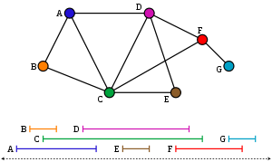
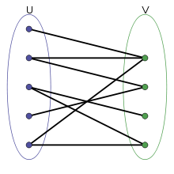

전날 11시부터 시작이었는데 깜박했다 ㅎㅎ!
아침에 일찍 일어나서 8~11시 동안 세 문제 풀..지는 못하고 세문제 읽고 두 문제 풀었다! 정답률이 1/4 에서 2/5로 올라갔다.. ㅋㅋㅋ

다음에는 시간 안에 세 문제 도전~

## Vestigium (7pts)

제일 점수가 낮지만 결국 시간 안에 못 푼 문제. ^^; 한번에 풀려고 하지 말고 문제 조건을 나눠서 보고 차근차근 풀어가야겠다.

* NA

```c++
#include <iostream>
using namespace std;
#include <cstring>

int N, k, row, col;
int arr[100][100];

int calRow(int i, int pos) {
    if (pos >= N - 1) return 0;
    for (int b = pos + 1; b < N; b++) {
        if (arr[i][pos] == arr[i][b]) {
            return 1;
        }
    }
    return calRow(i, pos + 1);
}
int calCol(int pos, int j) {
    if (pos >= N - 1) return 0;
    for (int b = pos + 1; b < N; b++) {
        if (arr[pos][j] == arr[b][j]) {
            return 1;
        }
    }
    return calCol(pos + 1, j);
}

int main()
{
    int T; cin >> T;
    for (int x = 1; x <= T; x++) {
        cin >> N;
        for (int i = 0; i < N; i++) {
            for (int j = 0; j < N; j++) {
                cin >> arr[i][j];
            }
        }

        k = row = col = 0;

        for (int i = 0; i < N; i++) {
            k += arr[i][i];
            row += calRow(i, 0);
            col += calCol(0, i);
        }


        printf("Case #%d: %d %d %d\n", x, k, row, col);
    }
}
```

#### Analysis

* My solution

각 행과 열에 중복되는 숫자가 있는지 확인하는 문제. 일단 행 i 에 중복된 숫자가 있는지 확인하는 알고리즘을 생각하자. arr[i][0] 과 나머지 arr[i][j] (j 는 1부터 n) 을 확인한다. arr[i][1] 과 나머지 arr[i][j] (j는 2부터 n) 을 확인한다 ...

이 때 이렇게 확인하는 도중 하나라도 같은 수가 있다면 그 행은 탐색이 종료되어 1을 반환한다.

열에 대해서도 같은 방법으로 한다.

근데 그냥 파이썬으로 풀 걸 그랬다~ 가성비 아까운 문제가 되어버림.

* Solution

1. 주어진 배열이 1부터 N 까지의 수로만 이루어져 있으므로, 각 행과 열을 순서대로 정렬하여 오름차 순으로 이루어져 있는지 탐색한다.

2. 정렬을 하지 않고 O(N) 시간에 풀 수 있는 방법은, 값을 하나씩 확인하고 해쉬 자료구조에 저장하는 것이다. 해쉬 구조에 저장하려고 할 때, 값이 이미 있다면, 그 행 또는 열이 중복되었다는 뜻이다.


#


## Nesting Depth (5ts, 11pts)

출력 잘못해서 패널티 먹음.. 힝

의식의 흐름대로 풀었는데 바로 되어서 다행이다.

더 깔끔하게 풀 수 있을 것 같은데 일단은 패쓰

* ??

```c++
#include <iostream>
using namespace std;
#include <queue>

queue<char> q;

int main()
{
    int T; cin >> T;
    for (int x = 1; x <= T; x++) {
        string str; cin >> str;
        int allnum = 0;

        for (char c : str) {
            if (q.empty()) {
                int num = c - '0'; allnum += num;
                for (int i = 0; i < num; i++) q.push('(');
                q.push(c);
            }
            else {
                char curr = q.back();
                if (curr < c) {
                    int num = c - curr; allnum += num;
                    for (int i = 0; i < num; i++) q.push('(');
                    q.push(c);
                }
                else if (curr > c) {
                    int num = curr - c; allnum -= num;
                    for (int i = 0; i < num; i++) q.push(')');
                    q.push(c);
                }
                else {
                    q.push(c);
                }

            }
        }


        printf("Case #%d: ", x);
        while (!q.empty()) {
            cout << q.front();
            q.pop();
        }
        for (int i = 0; i < allnum; i++) cout << ')';

        cout << endl;
    }
}

```


#### Analysis

1. 0 과 1 로 이루어져 있을 경우, 1 전에 여는 괄호 '( ' 를 넣고, 1 다음 0 이 올 경우에 ')' 를 넣는다. 혹은 01 을 '0(1' 로,  10 을 '1)0' 으로 바꾸면 된다.

2. 0~9 로 이루어져 있을 경우, 이전에 출력한 숫자 A 와, 지금 출력해야할 숫자 B 를 비교하여 괄호를 넣는다. A 와 B 의 차이만큼 괄호는 출력되는데(차이가 0이면 괄호를 넣지 않는다), A < B 일 경우 여는 괄호 '(' 를, B > A일 경우 ')' 를 넣는다. 마지막에 남은 닫는 괄호를 넣는다.

3. 비효율적이지만 가능한 해법:
The problem can be solved using only string replacements. First, replace each digit D with D (s, then the digit itself, then D )s. Then eliminate all instances of )(, collapsing the string each time, until there are no more to remove.

	Here's a Python3 implementation:
	```python
	for C in range(int(input())):
	  rawstr = ''.join([int(x) * '(' + x + ')' * int(x) for x in str(input())])
	  for _ in range(9):
	    rawstr = rawstr.replace(')(', '')
	  print("Case #{}: {}".format(C+1, rawstr))
	```

#

## Parenting Partnering (7pts, 12pts)

이전에 썼던 코드를 그냥 가져와서 수정했다. 헣. 다음에는 머릿속에서 가져오자!

* ??

```c++
#include <iostream>
#include <algorithm>
using namespace std;
#include <queue>

struct Element {
	int s, e, idx;
	char who;
};

bool cmp(Element e1, Element e2) {
	if (e1.s == e2.s)
		return e1.e < e2.e;
	return e1.s < e2.s;
}

bool cmp2(Element e1, Element e2) {
	return e1.idx < e2.idx;
}

int main() {
	int T; cin >> T; int cnt = 1;
	while (T--) {
		int n;
		cin >> n;
		Element* arr = new Element[n];
		for (int i = 0; i < n; i++) {
			cin >> arr[i].s >> arr[i].e;
			arr[i].idx = i;
		}
		sort(arr, arr + n, cmp);

		int tmpc = arr[0].e; arr[0].who = 'C';
		int tmpj = 0;
		bool possible = true;
		for (int i = 1; i < n; i++) {
			if (tmpc < tmpj) {
				if (tmpc <= arr[i].s) {
					tmpc = arr[i].e;
					arr[i].who = 'C';
				}
				else {
					possible = false; break;
				}
			}
			else {
				if (tmpj <= arr[i].s) {
					tmpj = arr[i].e;
					arr[i].who = 'J';
				}
				else {
					possible = false; break;
				}
			}
		}

		printf("Case #%d: ", cnt++);
		if (!possible) printf("IMPOSSIBLE\n");
		else {
			sort(arr, arr + n, cmp2);
			for(int i = 0; i<n; i++){
				cout << arr[i].who;
			}
			cout << endl;
		}

	}
}

```

#### Analysis

증명 방법은 잘 모르겠다.

1. The greedy assignment is correct because the only way that the assignment fails is when there is a time that is covered by three activities. In such a case, there is indeed no valid assignment. When deciding who to assign an activity with start time s, only activities with start times no later than s have been assigned. Therefore, if both Jamie and Cameron have some activity assigned with end time later than s, it means that there are three activities that use the time between s and s + 1, and therefore, there is no possible assignment. If an assignment is possible, there cannot be any set of three activities that pairwise overlap, so by the contrapositive of the the previous argument, we will be able to assign the activity to at least one of Jamie or Cameron at every step. O(N^2)

2.  O(N log N): we can efficiently check whether an activity can be assigned to Jamie or Cameron by keeping track of the end time of the last activity assigned to each partner and comparing this to the start time of the new activity. In this case, only O(N) extra time is needed after sorting the activities by their start time.


3. Graph Approach : 각각의 액티비티를 표현하는, N 개의 노드로 이루어진 그래프로도 문제를 풀 수 있다. 간선은 노드들의 시간이 겹칠 때 이어진다. 이 그래프는 **Interval Graph** 라고 한다. 이제 문제는 **Bipartite Graph** 를 구하는 문제로 바뀐다. 노드들을 C  그룹과 J 그룹으로 나눠서 C 그룹에 있는 모든 노드들이 J 그룹과 연결되도록 분리해야한다. 그래프는 N 개의 노드와 O(N^2) 개의 간선을 가지고 있으므로, 그래프를 만들고 탐색하는데 O(N^2) 이 걸린다. 


* Interval Graph
[https://en.wikipedia.org/wiki/Interval_graph](https://en.wikipedia.org/wiki/Interval_graph)


* Bipartite Graph
[https://en.wikipedia.org/wiki/Bipartite_graph](https://en.wikipedia.org/wiki/Bipartite_graph)


#

## ESAb ATAd (1pts, 9pts, 16pts)

* NA

#### Analysis


#

## Indicium (7pts, 25pts)

* NA

#### Analysis
